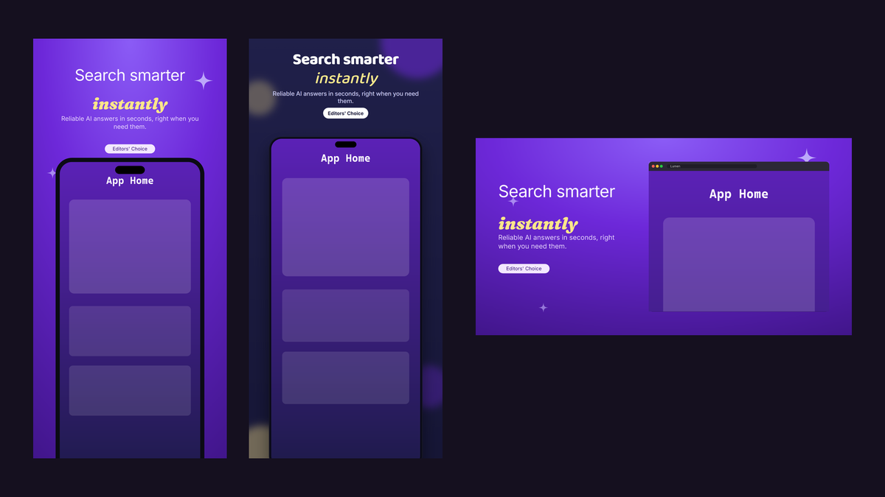
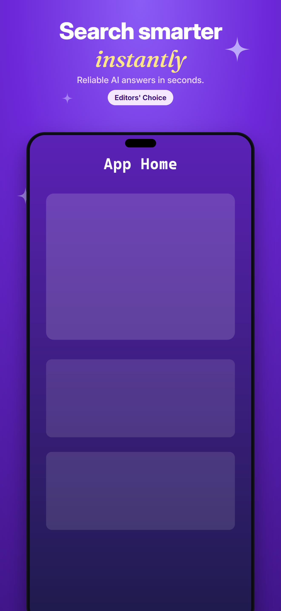
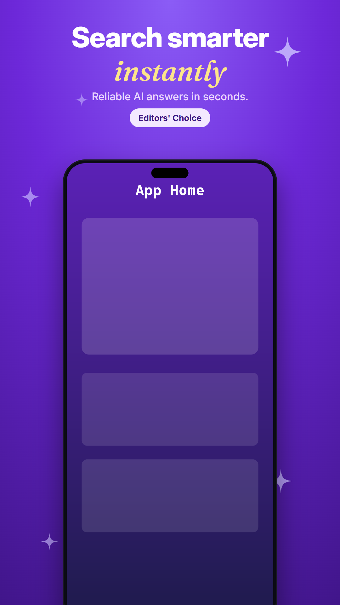
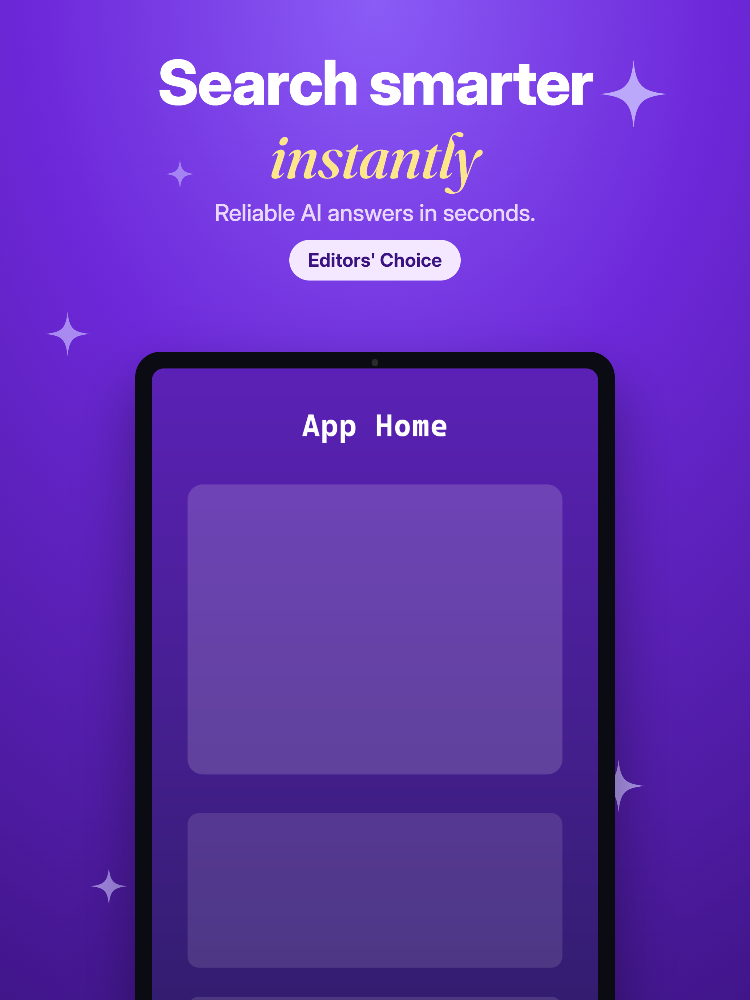
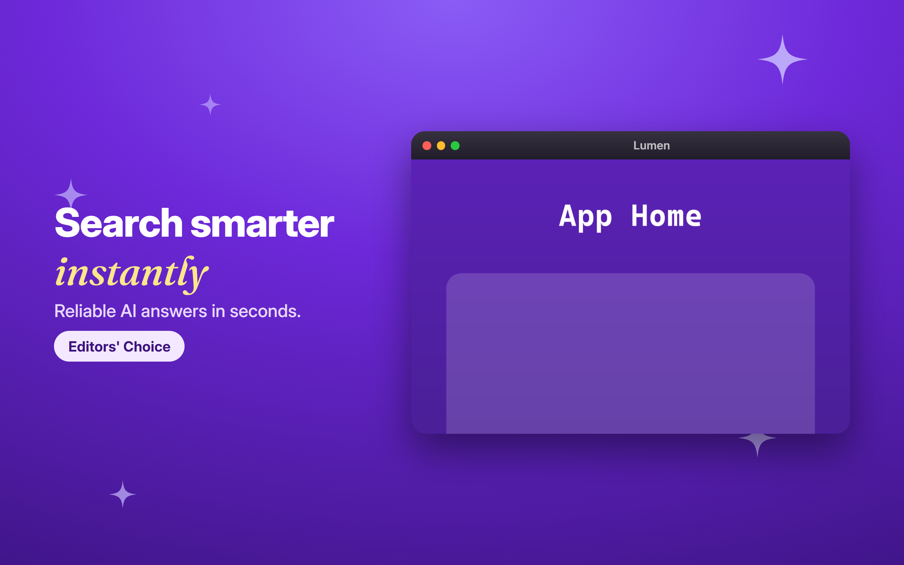
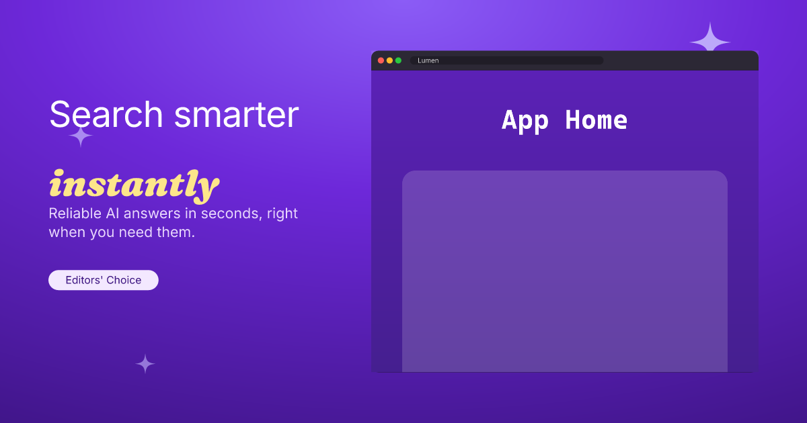

# app-promo-studio

A Claude Code **plugin** that generates cross-platform app **promotional images** from your own screenshots + a few headlines + brand colors — at exact platform sizes, in PNG / JPG / WebP / AVIF and **true vector SVG**.

Covers **phone** (App Store & Google Play), **iPad**, **desktop** (Mac / app window), **web** landing hero, and **social / Open-Graph** cards. One config drives everything; re-run to regenerate the whole set.



## Examples

All generated from one `promo.config.json` with the default `purple-gradient` theme and placeholder screenshots (see `docs/examples/`):

| iPhone App Store | Google Play | iPad |
|---|---|---|
|  |  |  |

| Mac App Store | Web hero / OG | Product Hunt |
|---|---|---|
|  |  |  |

`docs/examples/` also includes the Play feature graphic, Play icon, desktop window, and Instagram portrait variants.

## Why

Making store screenshots by hand in a design tool is slow and easy to get wrong (every platform has different required pixel sizes, alpha rules, and count limits). This plugin fixes the whole pipeline into a repeatable, config-driven workflow you invoke from Claude Code.

## How it works

Two render engines share one theme system and one `promo.config.json`:

- **HTML/CSS + Playwright** (primary) — renders designed slides with the system Chrome at the exact CSS-viewport × deviceScaleFactor for each target, then `sharp` exports every format and flattens alpha where stores forbid it. Highest fidelity.
- **Native SVG + resvg** (vector track) — emits real `.svg` (infinitely scalable) and rasterizes with bundled fonts, no browser.

Device frames (phone, tablet, Mac window, browser window) are drawn in pure CSS/SVG — no binary mockup assets — so everything stays crisp at any size.

## Install

Requires **Node 18+** and **Google Chrome** installed (Playwright uses it via `channel:"chrome"` — no Chromium download).

### Use immediately (dev)
```bash
claude --plugin-dir /path/to/app-promo-studio
```
Then in Claude Code: `/app-promo-studio:promo` — or just ask, e.g. *"make App Store and Play screenshots for my app."*

### Permanent personal install (every project)
```text
/plugin marketplace add /path/to/app-promo-studio
/plugin install app-promo-studio@app-promo-studio-marketplace
```

On first use the skill runs `npm install` inside `skills/app-promo-images/scripts/` to fetch `playwright`, `sharp`, `@resvg/resvg-js`. Fonts (Inter, Fraunces, Baloo 2) are bundled.

## Usage

Ask Claude (it gathers inputs, writes the config, runs the scripts), or drive the scripts directly:

```bash
cd skills/app-promo-images/scripts
npm install                                   # first time
node render.mjs my-app.config.json            # PNG/JPG/WebP/AVIF
node render.mjs my-app.config.json --dry      # preview job list
node render-svg.mjs my-app.config.json        # .svg + raster
```

Minimal config:
```json
{
  "app": { "name": "Lumen", "brandColor": "#6d28d9" },
  "theme": "purple-gradient",
  "targets": ["ios", "play-phone", "og"],
  "formats": ["png", "webp"],
  "outDir": "./promo-out",
  "slides": [
    { "headline": "Search smarter", "highlight": "instantly",
      "subheadline": "Answers in seconds.", "screenshot": "./home.png", "badge": "Editors' Choice" }
  ]
}
```

See `skills/app-promo-images/scripts/promo.config.example.json` and the docs:
- `skills/app-promo-images/references/platform-specs.md` — every size & rule
- `skills/app-promo-images/references/workflow.md` — full config schema + examples
- `skills/app-promo-images/references/design-recipes.md` — themes, layouts, copywriting

## Targets

IDs: `appstore-iphone-6.9`, `appstore-iphone-6.5`, `appstore-ipad-13`(`-landscape`), `mac-appstore`, `play-phone`, `play-feature`, `play-icon`, `desktop-window`, `web-hero`, `og`, `twitter`, `instagram-portrait`/`-square`/`-story`, `producthunt`, `linkedin`.

Bundles: `ios`, `android`, `mobile`, `desktop`, `web`, `social`, `all-stores`.

Add sizes by editing `scripts/specs.json`; add themes via `scripts/themes.json` — no code changes.

## Extending
- **New platform size** → add to `scripts/specs.json`.
- **New theme** → add to `scripts/themes.json`.
- **New layout / device frame** → edit `templates/html/styles.css` (+ `renderer.html`) and, for the vector track, `templates/svg/slide.svg.mjs`.

## License
MIT
